# Ray Tracing in Go

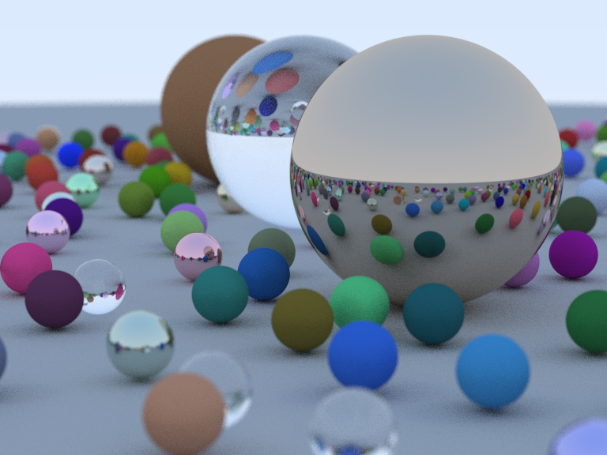

A Go implementation of the book [Ray Tracing in One Weekend](https://raytracing.github.io/). The repository provides a library to describe and render your own scenes. For more detail, see [`examples/main.go`](examples/main.go).

## Getting Started

```shell
git clone git@github.com:y-taka-23/raytracing-go.git
cd raytracing-go
make examples
./bin/example > example.ppm
open example.ppm
```

## Materials

### Lambertian

|color|result|
|:----:|:----:|
|(0.8, 0.1, 0.1)|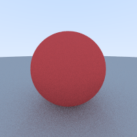|
|(1.0, 1.0, 1.0)|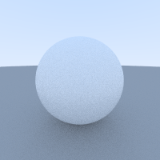|
|(0.0, 0.0, 0.0)|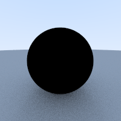|

### Metalic

|fuzziness|result|
|:----:|:----:|
|0.0|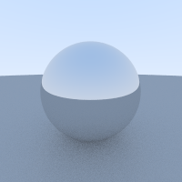|
|0.15|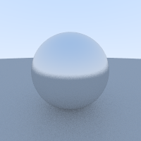|
|0.3|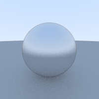|

### Dielectric

|refractive index|result|
|:----:|:----:|
|1.0|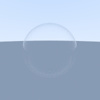|
|1.5|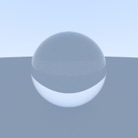|
|2.0|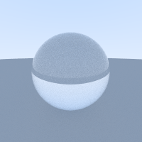|


## Camera Setting

### Angle of View

|virtical angle (degree)|result|
|:----:|:----:|
|90|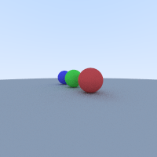|
|60|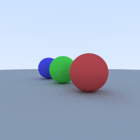|
|30|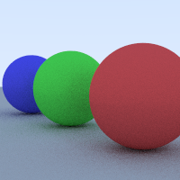|

### Aperture

|aperture|result|
|:----:|:----:|
|0.0||
|0.5||
|1.0|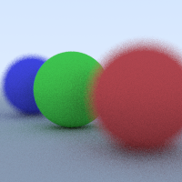|

### Depth of Field

|focus distance|result|
|:----:|:----:|
|6|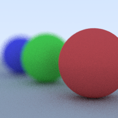|
|9||
|12|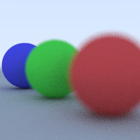|

## Reference

* Shirley, P. (2016). _Ray Tracing in One Weekend_ ([online edition available](https://raytracing.github.io/))
